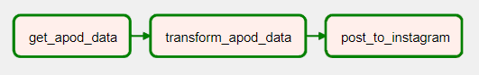

# Astrobot

## [Instagram (@astropyx)](https://www.instagram.com/astropyx/)

:warning:**Account in no longer active**:warning: 
(I accomplished my goal and didn't want to continue to pay for the EC2 instance.)

## Tools Used
Apache Airflow, AWS (S3, EC2), NASA API, Instagram API

## Methodology
I built an automated ETL workflow using Apache Airflow which runs on an EC2 instance.
1. **📜 Extract:** Extract relevant json data from NASA's API.
2. **🔃 Transform:** Convert the json data into an image and caption.
3. **📷 Load:** Post the data to Instagram using their API.

Workflow DAG 

## References
Data from [NASA's Astronomy Picture of the Day](https://apod.nasa.gov/apod/astropix.html)
