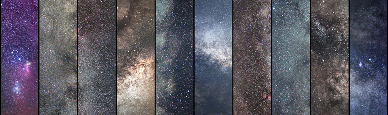

# Instagram Bot for NASA Astronomy Picture of the Day

## Account
https://www.instagram.com/astropyx/

Posts every day at 12:15am EST

## Tools Used
Apache Airflow, AWS (S3, EC2), NASA API, Instagram API

## Methodology
I built an automated ETL workflow using Apache Airflow which runs on an EC2 instance.
1. **📜 Extract:** Extract relevant json data from NASA's API.
2. **🔃 Transform:** Convert the json data into an image and caption.
3. **📷 Load:** Post the data to Instagram using their API.
